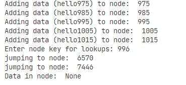

# PChord

An simple implementation of the Chord Distributed Hash Table in Python.

## Description

Chord DHT is implemented in python. You can add data to the nodes and then observe the lookups for a specific node,



### Dependencies

* python

### Installing

* Clone the repo
```
git clone https://github.com/imranzaheer612/chord-dht-python.git
```


## License

This project is licensed under the [GNU General Public License] License - see the LICENSE.md file for details

## Acknowledgments

This repo helped alot.
* [ Chord DHT simulation in Python ](https://github.com/lihuang916/PChord.git)